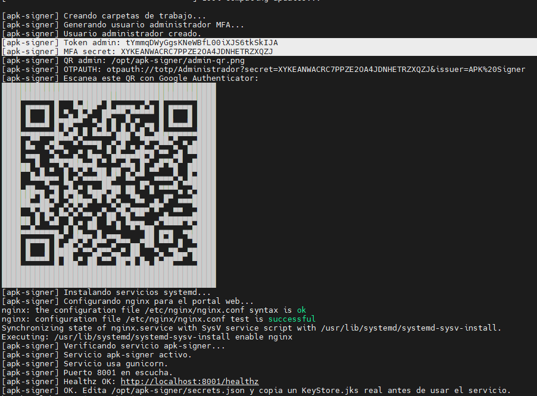
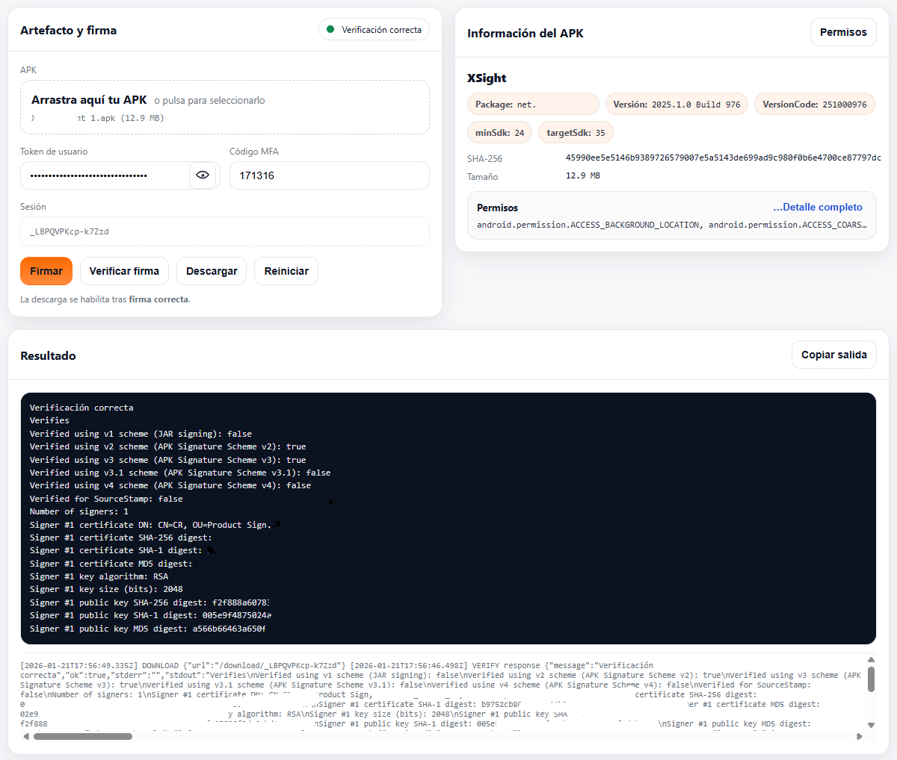
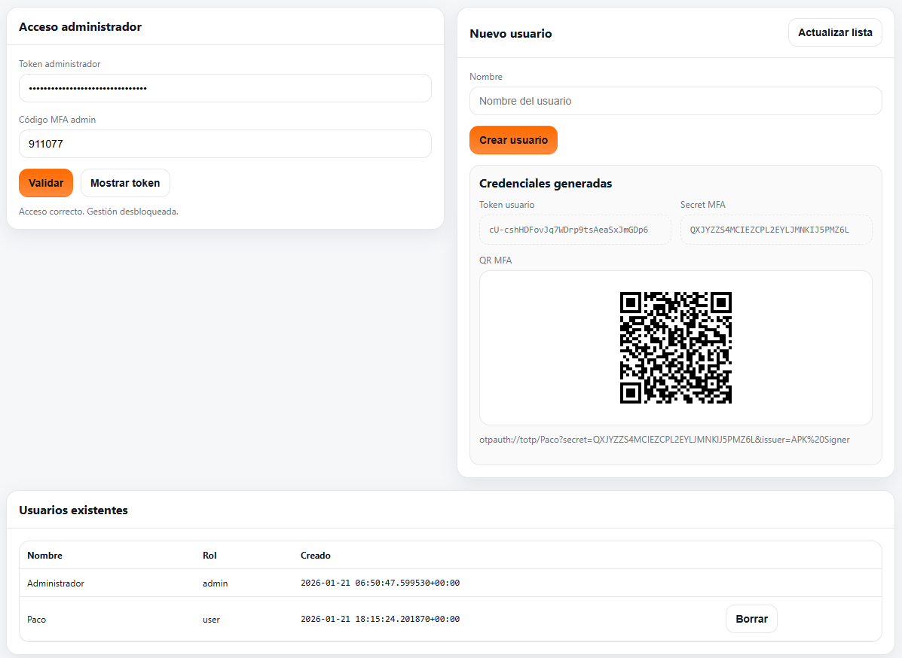

# APK Signer Web

Servicio web para inspeccionar APKs y firmarlos con un keystore local. Expone una UI estática y una API REST en `/:8001`, y publica el portal vía nginx en `http://localhost/`.

## Estado del repositorio

El repositorio incluye el backend, UI, scripts y servicios systemd. Para ejecutar en Debian/Ubuntu se requiere instalar dependencias del sistema, Android Build Tools (`aapt2`/`apksigner.jar`) y un keystore real. El script `setup.sh` ahora descarga e instala automáticamente los Build Tools públicos y configura rutas por defecto.

## Requisitos

* Debian 11+/Ubuntu 20.04+.
* Python 3.9+ (con `venv`) y `pip`.
* Java 17 (JRE) para ejecutar `apksigner.jar`.
* Android Build Tools para `aapt2` y `apksigner.jar` (instalados por `setup.sh`).
* Un keystore real (JKS) con alias y contraseñas válidas.
* MFA (TOTP) para firmar: se genera un usuario administrador durante la instalación.

> Nota: el keystore no se incluye en el repo. Debe copiarse localmente y configurarse en `secrets.json`.

## Ejecución en Docker (con volúmenes persistentes)

1. Copia el ejemplo de secretos y edítalo:

   ```bash
   cp secrets.example.json secrets.json
   ```

   Ajusta rutas en `secrets.json` para apuntar a `/opt/apk-signer/...` (ya vienen así en el ejemplo).

2. Crea las carpetas locales que se persistirán en el host:

   ```bash
   mkdir -p keystore work logs
   ```

3. Deposita tu `KeyStore.jks` en `./keystore/KeyStore.jks` y completa alias + contraseñas reales en `secrets.json`.

4. Genera `users.json` si aún no existe:

   ```bash
   python3 tools/bootstrap_users.py
   ```

5. Levanta el servicio:

   ```bash
   docker compose up --build
   ```

El `Dockerfile` ya instala el SDK de Android y los Build Tools dentro de la imagen (aapt2 y apksigner.jar), por lo que no necesitas preparar `android-sdk` en el host. Si quieres reutilizar un SDK local, puedes montar un volumen adicional a `/opt/android-sdk` en `docker-compose.yml`.

El `docker-compose.yml` monta `./keystore` y `./secrets.json` para que el usuario pueda gestionar el keystore y los secretos desde el host. También persiste `work`, `logs` y `users.json` en el directorio local del repo.

La aplicación (scripts, `app.py` y HTML estático de `static/`) se incluye en la imagen a través del `Dockerfile` con `COPY . /opt/apk-signer`, por lo que el build empaqueta el código del repo; el `docker-compose.yml` solo se encarga de publicar el puerto y montar los volúmenes persistentes.

## Instalación rápida (modo sistema con systemd)

1. Clona el repo y ejecuta el instalador (como root). El script usa el código del clon local, no requiere URL adicional:

   ```bash
   git clone https://github.com/koldogut/apk-signer.git
   cd apk-signer
   sudo bash setup.sh
   ```

2. Durante la instalación se abrirá el aceptador de licencias de `sdkmanager` (confirma con `y` cuando se solicite).
3. El instalador generará un usuario administrador MFA y mostrará el token + QR para Google Authenticator.
4. Edita `/opt/apk-signer/secrets.json` con alias y contraseñas reales.
5. Copia tu `KeyStore.jks` a `/opt/apk-signer/keystore/KeyStore.jks`.
6. Verifica estado:

   ```bash
   curl -s http://localhost:8001/healthz | jq
   ```

Accede a `http://localhost/admin` para gestionar usuarios y generar nuevos QR MFA (requiere token + MFA del admin).

## Comprobaciones básicas de funcionamiento

Ejecuta estos comandos para confirmar que el servicio web está levantado y sirviendo la UI:

```bash
sudo systemctl status apk-signer.service --no-pager
sudo systemctl status nginx --no-pager
sudo journalctl -u apk-signer.service -n 200 --no-pager
ss -tulpn | grep 8001
curl -s http://localhost:8001/healthz | jq
curl -I http://localhost/
```

Si `/healthz` no responde, revisa permisos de `/opt/apk-signer`, la existencia de `secrets.json` y de `users.json`, y que el servicio `apk-signer` esté activo.

Si necesitas diagnosticar por tu cuenta, revisa estado, logs y el listener del puerto antes de reintentar la instalación.

Si faltan `secrets.json` o el `KeyStore.jks`, el portal mostrará una advertencia y la firma quedará deshabilitada hasta completar esos pasos.

Si ves errores 413 al subir APKs, revisa el límite `client_max_body_size` en la configuración de nginx.

Para más detalles y solución de errores, revisa `docs/INSTALACION.md` y `docs/RESUMEN_ERRORES.md`.

## Capturas de la aplicación

A continuación se muestran capturas representativas del flujo completo de instalación, firma y gestión de usuarios:

1. **Setup inicial con MFA**: token de administrador y QR generado durante `setup.sh`.

   

2. **Flujo de firma principal**: pantalla de firma con resultado y verificación posterior.

   

3. **Gestión de usuarios**: creación de un usuario nuevo desde el panel administrativo.

   

## Ejecución en Docker (con volúmenes persistentes)

1. Construye la imagen:

   ```bash
   docker compose build
   ```

2. Crea las carpetas locales que se persistirán en el host:

   ```bash
   mkdir -p keystore work logs
   ```

3. Copia el ejemplo de secretos y edítalo:

   ```bash
   cp secrets.example.json secrets.json
   ```

   Ajusta rutas en `secrets.json` para apuntar a `/opt/apk-signer/...` (ya vienen así en el ejemplo).

4. Deposita tu `KeyStore.jks` en `./keystore/KeyStore.jks` y completa alias + contraseñas reales en `secrets.json`.

5. Genera `users.json` si aún no existe:

   ```bash
   python3 tools/bootstrap_users.py
   ```

6. Levanta el servicio:

   ```bash
   docker compose up
   ```

El `Dockerfile` ya instala el SDK de Android y los Build Tools dentro de la imagen (aapt2 y apksigner.jar), por lo que no necesitas preparar `android-sdk` en el host. Si quieres reutilizar un SDK local, puedes montar un volumen adicional a `/opt/android-sdk` en `docker-compose.yml`.

El `docker-compose.yml` monta `./keystore` y `./secrets.json` para que el usuario pueda gestionar el keystore y los secretos desde el host. También persiste `work`, `logs` y `users.json` en el directorio local del repo.

La aplicación (scripts, `app.py` y HTML estático de `static/`) se incluye en la imagen a través del `Dockerfile` con `COPY . /opt/apk-signer`, por lo que el build empaqueta el código del repo; el `docker-compose.yml` solo se encarga de publicar el puerto y montar los volúmenes persistentes.
