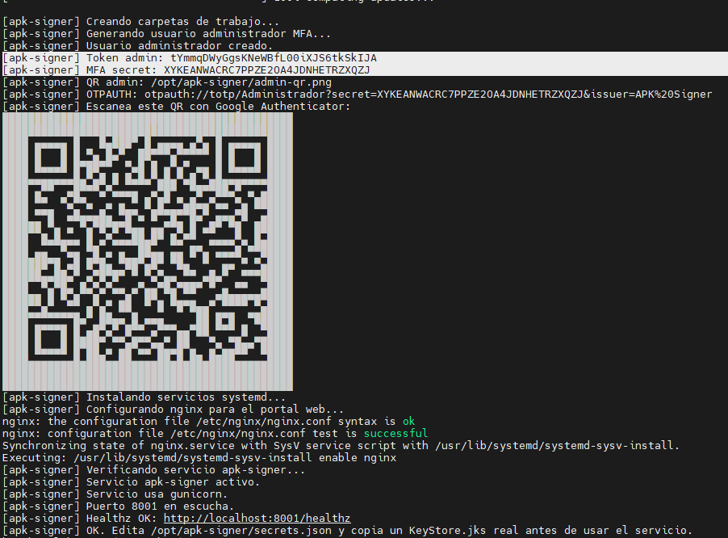
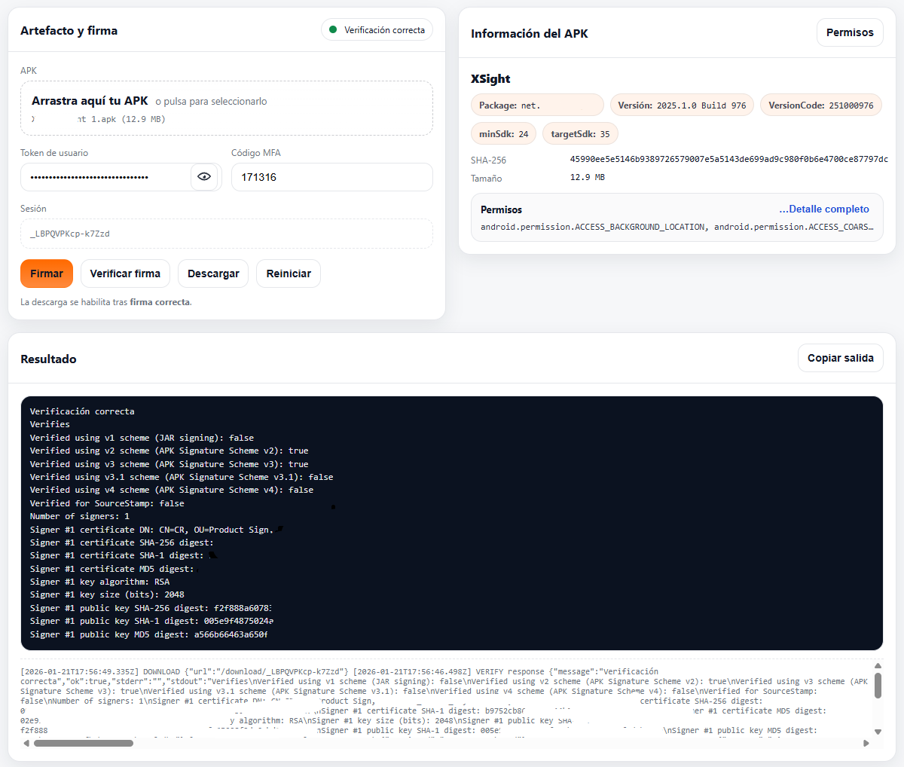
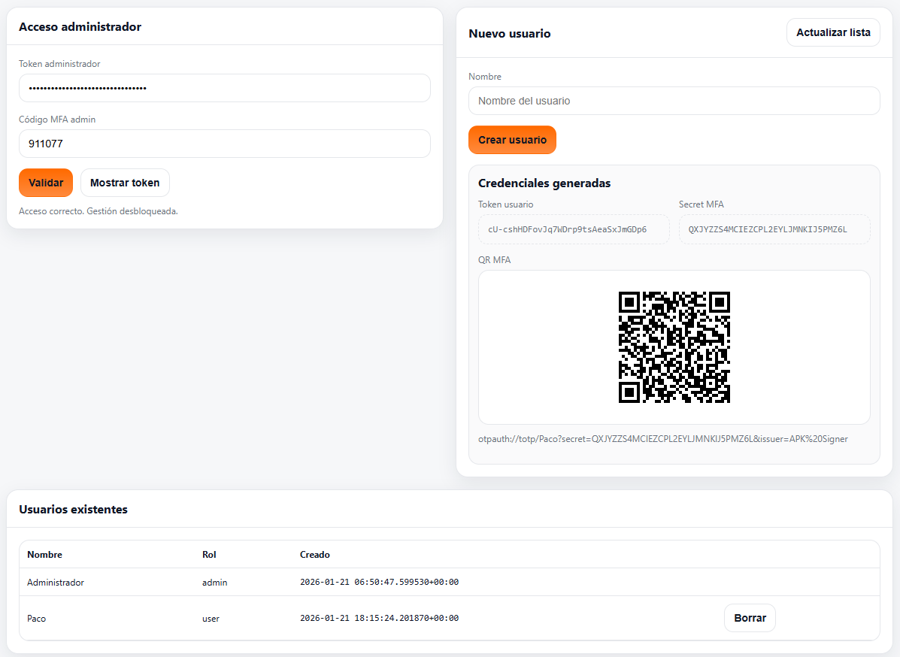

# APK Signer Web

Servicio web para inspeccionar APKs y firmarlos con un keystore local. Expone una UI estática y una API REST en `/:8001`, y publica el portal vía nginx en `https://localhost/` (el puerto 80 redirige a HTTPS).

## Estado del repositorio

El repositorio incluye el backend, la UI, los scripts de despliegue y las unidades de systemd.

* `setup.sh` instala desde cero: dependencias del sistema, Android Build Tools (`aapt2`, `apksigner.jar`, `zipalign`), certificado TLS, usuario administrador MFA y servicios.
* `update.sh` actualiza una instalación existente conservando la configuración y los datos, con copia de seguridad y reversión automática.
* Lo único que hay que aportar es un **keystore JKS real**: no se incluye en el repo y debe copiarse a mano.

El código está separado en `config` / `audit` / `auth` / `signing` / `app`, con 100 tests y CI que cubre tests, `ruff`, `bandit`, `pip-audit` y la validación de la configuración de nginx.

## Requisitos

* Debian 12+ / Ubuntu 24.04+ (por la versión de Python del sistema).
* Python 3.11+ (con `venv`) y `pip`.
* Java 17 (JRE) para ejecutar `apksigner.jar`.
* Android Build Tools para `aapt2` y `apksigner.jar` (instalados por `setup.sh`).
* Un keystore real (JKS) con alias y contraseñas válidas.
* MFA (TOTP) para firmar, descargar y consultar la traza: se genera un usuario administrador durante la instalación.
* Un certificado TLS. `setup.sh` genera uno autofirmado si no existe; sustitúyelo por el corporativo.

> Nota: el keystore no se incluye en el repo. Debe copiarse localmente y configurarse en `secrets.json`.

> **Por qué 3.11 y no 3.9.** En Python 3.9 no existe una versión de `pillow` sin vulnerabilidades conocidas: los parches (12.1.1 en adelante) requieren 3.10+, y lo mismo pasa con `click` 8.3.3. `pillow` entra como dependencia de `qrcode[pil]`, que solo se usa para generar el PNG del QR de MFA a partir de una URI que construye el propio servicio, así que la exposición real es baja —no se parsea ninguna imagen ajena—, pero un `pip-audit` sobre un despliegue en 3.9 sale en rojo y no hay forma de arreglarlo sin subir de versión. 3.11 es además la versión del `Dockerfile`.
>
> Si necesitas desplegar sobre Debian 11 o Ubuntu 22.04, instala un Python 3.11 aparte (por ejemplo con `deadsnakes`) y apunta el `venv` a él en lugar de usar el del sistema.

## Instalación rápida (modo sistema con systemd)

1. Clona el repo y ejecuta el instalador (como root). El script usa el código del clon local, no requiere URL adicional:

   ```bash
   git clone https://github.com/koldogut/apk-signer.git
   cd apk-signer
   sudo bash setup.sh
   ```

2. Durante la instalación se abrirá el aceptador de licencias de `sdkmanager` (confirma con `y` cuando se solicite).
3. El instalador generará un usuario administrador MFA y mostrará el token + QR para Google Authenticator.
4. Edita `/opt/apk-signer/secrets.json` con alias y contraseñas reales.
5. Copia tu `KeyStore.jks` a `/opt/apk-signer/keystore/KeyStore.jks`.
6. Verifica estado:

   ```bash
   curl -s http://localhost:8001/healthz | jq
   ```

Accede a `https://localhost/admin` para gestionar usuarios y generar nuevos QR MFA (requiere token + MFA del admin).

### Certificado TLS

El portal solo se sirve por HTTPS: el token de usuario y el código MFA no deben viajar en claro. `setup.sh` genera un certificado **autofirmado** en `/etc/ssl/apk-signer/` si no encuentra uno, lo que provocará un aviso del navegador. Para usar un certificado corporativo, sustituye los dos ficheros y recarga nginx:

```bash
sudo cp tu-certificado.crt /etc/ssl/apk-signer/apk-signer.crt
sudo cp tu-clave.key /etc/ssl/apk-signer/apk-signer.key
sudo chmod 0640 /etc/ssl/apk-signer/apk-signer.key
sudo nginx -t && sudo systemctl reload nginx
```

Puedes cambiar las rutas con las variables `TLS_CERT` y `TLS_KEY` al ejecutar `setup.sh`.

## Actualización de una instalación existente

`setup.sh` instala desde cero. Para actualizar una instalación que ya está en marcha, usa `update.sh`:

```bash
cd apk-signer
git pull
sudo bash update.sh
```

Qué hace, y qué no:

* **Actualiza** el código, las dependencias Python (`pip install -U -r requirements.txt`), las unidades de systemd y la configuración de nginx.
* **Conserva** `secrets.json`, `users.json`, el keystore, la traza de auditoría y las sesiones de trabajo.
* **Añade a `secrets.json` las claves nuevas** que aparezcan en `secrets.example.json`, sin tocar los valores que ya tengas configurados. Es lo que permite que una instalación antigua reciba opciones nuevas.
* **No** instala paquetes del sistema ni el SDK de Android: da por hecho que ya están. Si cambia `BUILD_TOOLS_VERSION`, vuelve a ejecutar `setup.sh`.
* **Hace copia de seguridad antes de tocar nada** en `/var/backups/apk-signer/` (configuración, usuarios, keystore y traza; se excluyen las sesiones de trabajo por tamaño). Conserva las 5 últimas, ajustable con `KEEP_BACKUPS`.
* **Revierte automáticamente** si el servicio no vuelve a responder en `/healthz` tras el reinicio, y muestra los registros del fallo.

Variables útiles:

```bash
sudo KEEP_BACKUPS=10 bash update.sh   # conservar más copias
sudo SKIP_DEPS=1 bash update.sh       # solo código, sin tocar dependencias
```

La versión instalada se guarda en `/opt/apk-signer/.version` y `update.sh` la muestra al empezar, junto con la del clon.

### Restaurar una copia a mano

```bash
sudo systemctl stop apk-signer
sudo tar -xzf /var/backups/apk-signer/apk-signer-AAAAMMDD-HHMMSS.tar.gz -C /opt/apk-signer
sudo chown -R apk-signer:apk-signer /opt/apk-signer
sudo systemctl start apk-signer
```

## Comprobaciones básicas de funcionamiento

Ejecuta estos comandos para confirmar que el servicio web está levantado y sirviendo la UI:

```bash
sudo systemctl status apk-signer.service --no-pager
sudo systemctl status nginx --no-pager
sudo journalctl -u apk-signer.service -n 200 --no-pager
ss -tulpn | grep 8001
curl -s http://localhost:8001/healthz | jq
curl -I http://localhost/          # debe responder 301 hacia https://
curl -kI https://localhost/        # -k por el certificado autofirmado
```

Si `/healthz` no responde, revisa permisos de `/opt/apk-signer`, la existencia de `secrets.json` y de `users.json`, y que el servicio `apk-signer` esté activo.

Si necesitas diagnosticar por tu cuenta, revisa estado, logs y el listener del puerto antes de reintentar la instalación.

Si faltan `secrets.json` o el `KeyStore.jks`, el portal mostrará una advertencia y la firma quedará deshabilitada hasta completar esos pasos.

Si ves errores 413 al subir APKs, revisa el límite `client_max_body_size` en la configuración de nginx (100m, alineado con `MAX_CONTENT_LENGTH` de `secrets.json`).

## Control de acceso

El token de usuario y el código MFA **se canjean una sola vez** por una sesión corta (15 min por defecto). Esa sesión es la que autoriza el resto de operaciones, y viaja en la cabecera `Authorization: Bearer <authToken>` o en el campo `authToken` del cuerpo.

| Endpoint | Método | Requiere | Notas |
|---|---|---|---|
| `/api/auth/login` | POST | token + MFA | Devuelve `authToken` y `expiresAt` |
| `/api/auth/logout` | POST | `authToken` | Invalida la sesión |
| `/inspect` | POST | — | Sube e inspecciona el APK |
| `/sign` | POST | sesión | Alinea con `zipalign` y firma |
| `/verify` | POST | — | Solo sobre una sesión ya firmada |
| `/download` | POST | sesión | Solo quien firmó la sesión, o un admin |
| `/logs/data` | POST | sesión | Un admin ve toda la traza; un usuario, solo sus eventos |
| `/logs/verify` | POST | sesión con rol `admin` | Verifica MAC y encadenado de la traza completa |
| `/api/admin/*` | POST | sesión con rol `admin` | |

Ejemplo desde consola:

```bash
AUTH=$(curl -sk https://localhost/api/auth/login \
  -H 'Content-Type: application/json' \
  -d '{"userToken":"TU_TOKEN","mfaCode":"123456"}' | jq -r .authToken)

curl -sk https://localhost/logs/data \
  -H "Authorization: Bearer $AUTH" \
  -H 'Content-Type: application/json' -d '{"limit":50}' | jq
```

### Defensas frente a fuerza bruta

* **Anti-replay**: cada código TOTP se canjea una única vez. El contador consumido se guarda por usuario, así que un código capturado no sirve para abrir una segunda sesión.
* **Bloqueo por intentos**: tras `MAX_AUTH_FAILURES` (5) intentos fallidos, el usuario queda bloqueado `AUTH_LOCKOUT_MINUTES` (15) minutos, incluso si después acierta. Los tokens desconocidos se contabilizan por IP.
* **Rate limiting en nginx**: `/api/auth/login` limitado a 12 peticiones/minuto por IP, `/inspect` a 20/minuto y 3 conexiones simultáneas, el resto a 10/segundo. Devuelve `429`.

El estado (sesiones, contadores y bloqueos) vive en `AUTH_STATE_PATH` con bloqueo exclusivo de fichero, para que sea coherente entre los varios workers de gunicorn.

> Cambios respecto a versiones anteriores: `GET /download/<sessionId>` y `GET /logs/data` ya no existen, y `/sign`, `/download`, `/logs/data` y `/api/admin/*` ya no aceptan `userToken`/`mfaCode`/`adminToken`/`adminCode`: usan la sesión.

## Alineado de los APK

Antes de firmar, el servicio ejecuta `zipalign -p -f 4` sobre el APK subido. Es obligatorio hacerlo **antes** de firmar: alinear después invalidaría la firma. `setup.sh` y el `Dockerfile` instalan `zipalign` junto a `aapt2` y `apksigner.jar`.

Si `zipalign` no está configurado o falla, la firma continúa pero la respuesta incluye `"aligned": false` y un `warning`, y queda registrado en la traza. Comprueba `zipalign_exists` en `/healthz`.

### Tamaño de página

Las librerías nativas sin comprimir (`extractNativeLibs="false"`) deben quedar alineadas al tamaño de página del dispositivo. Android 15+ exige **16 KB**, y el `-p` clásico de `zipalign` solo alinea a 4 KB.

El servicio usa `-P 16` por defecto (`ZIPALIGN_PAGE_KB` en `secrets.json`), que requiere **Build Tools 35 o superior**. Si el `zipalign` instalado no admite `-P` —el de Build Tools 34 no—, degrada a 4 KB, lo dice en el `warning` de la firma y lo refleja en `alignPageKb`.

| | Build Tools 34 | Build Tools 35+ |
|---|---|---|
| Argumentos | `-p -f 4` | `-P 16 -f 4` |
| Alineado de las `.so` | 4 KB | 16 KB |
| Android 15+ | insuficiente | correcto |

`/healthz` informa del valor efectivo en `zipalign_page_kb`.

**Librerías comprimidas.** El alineado solo aplica a las `.so` almacenadas sin comprimir. Con `extractNativeLibs="true"` van deflatadas dentro del APK, no se pueden mapear en memoria y `zipalign` las marca `OK - compressed`: se saltan a propósito. En un APK mixto, cada librería recibe el trato que corresponde a su método. Que una `.so` comprimida aparezca en un offset no alineado es lo esperado, no un fallo.

| `.so` en el APK | Qué hace el servicio |
|---|---|
| Sin comprimir (`Stored`) | Alinea a `ZIPALIGN_PAGE_KB` |
| Comprimida (`Deflated`) | La deja como está (exenta) |
| Mixto | Cada una según su método |

## Traza de auditoría

Cada evento se registra en `logs/app.jsonl` con:

* un **MAC** (HMAC-SHA256 con `LOG_HMAC_KEY`), que detecta la modificación de esa línea;
* un **encadenado**: `seq` correlativo y `prev` con el hash del evento anterior.

La diferencia importa. Un MAC por línea no ve que se hayan **borrado** eventos: las líneas que quedan siguen siendo válidas una por una. El encadenado sí, porque el `prev` del siguiente deja de cuadrar.

Un administrador puede recorrer la traza entera desde el botón "Verificar cadena" del modal de Logs, o por API:

```bash
curl -sk https://localhost/logs/verify \
  -H "Authorization: Bearer $AUTH" \
  -H 'Content-Type: application/json' -d '{}' | jq .summary
```

La rotación (`cleanup.py`, cada hora si el fichero pasa de 10 MB) deja en el fichero nuevo un evento `log-rotated` que enlaza con el hash del último evento del fichero rotado, para que la cadena no se parta al rotar.

> Límite: la cadena detecta manipulación, pero no la impide, y quien controle la máquina puede borrar la traza entera y el fichero rotado. Para tamper-evidence real, configura `SYSLOG_ADDRESS` (`"host:514"` o `"/dev/log"`) y envía la traza a un syslog o SIEM fuera de la máquina.

## Aislamiento del servicio

La unit de systemd corre con `ProtectSystem=strict`, `PrivateTmp`, `NoNewPrivileges` y `SystemCallFilter=@system-service`, con `/opt/apk-signer` como único árbol escribible.

Dos avisos si tocas ese fichero:

* `MemoryDenyWriteExecute` **no** está activado a propósito: la JVM que ejecuta `apksigner` necesita páginas W+X para el JIT y el servicio no arrancaría.
* `SystemCallFilter` es el candado más restrictivo. Si `apksigner` empieza a fallar tras actualizar Java, es lo primero que hay que comentar.

Para sacar las contraseñas del árbol de la aplicación, deja el fichero en `/etc/apk-signer/secrets.json` (`root:root`, `0600`) y descomenta la línea `LoadCredential=` de la unit. La aplicación lo detecta por `$CREDENTIALS_DIRECTORY` sin ningún otro cambio.

Para más detalles y solución de errores, revisa `docs/INSTALACION.md` y `docs/RESUMEN_ERRORES.md`.

## Desarrollo

El código está separado por responsabilidad, con las dependencias en una sola dirección (`config` → `audit` → `auth` → `signing` → `app`):

| Módulo | Contenido |
|---|---|
| `config.py` | Carga de secretos, rutas y constantes |
| `audit.py` | Traza encadenada, MAC y verificación |
| `auth.py` | TOTP, anti-replay, sesiones y bloqueo |
| `signing.py` | Inspección con `aapt2`, alineado y firma |
| `app.py` | Aplicación Flask y rutas |

`app:app` sigue siendo el punto de entrada, así que la unit de systemd y el `Dockerfile` no cambian.

### Tests

```bash
pip install -r requirements-dev.txt
pytest
```

Las herramientas externas (`java`/`apksigner`, `aapt2`, `zipalign`) se sustituyen por scripts en `tests/fakebin/` que se anteponen al `PATH`. Los tests recorren así el mismo código de `subprocess` que producción —incluido el paso de contraseñas por entorno— sin necesitar el Android SDK. La configuración de prueba se inyecta con `CREDENTIALS_DIRECTORY`, el mismo mecanismo que usa systemd con `LoadCredential=`.

> No hay cobertura de integración contra Build Tools reales: haría falta el SDK de Android, que no está disponible en CI. Lo que se valida es el contrato con esas herramientas (orden de invocación, argumentos y entorno), no su comportamiento interno.

### Comprobaciones automáticas

`.github/workflows/ci.yml` ejecuta en cada push y PR:

* `pytest` en Python 3.11 y 3.12 (el mínimo soportado y el siguiente);
* `ruff` sobre todo el repo y `bash -n setup.sh`;
* `bandit` y `pip-audit` sobre las dependencias de producción, **en la versión mínima soportada**: la resolución de dependencias depende de la versión de Python, y auditar solo en la más nueva ocultaría vulnerabilidades que sí afectan al mínimo declarado;
* `nginx -t` sobre `nginx/apk-signer.conf`, con un certificado de usar y tirar.

Dependabot vigila `pip`, las GitHub Actions y la imagen base del `Dockerfile`.

## Capturas de la aplicación

A continuación se muestran capturas representativas del flujo completo de instalación, firma y gestión de usuarios:

1. **Setup inicial con MFA**: token de administrador y QR generado durante `setup.sh`.

   

2. **Flujo de firma principal**: pantalla de firma con resultado y verificación posterior.

   

3. **Gestión de usuarios**: creación de un usuario nuevo desde el panel administrativo.

   

## Ejecución en Docker (con volúmenes persistentes)

1. Construye la imagen:

   ```bash
   docker compose build
   ```

2. Crea las carpetas locales que se persistirán en el host:

   ```bash
   mkdir -p keystore work logs
   ```

3. Copia el ejemplo de secretos y edítalo:

   ```bash
   cp secrets.example.json secrets.json
   ```

   Ajusta rutas en `secrets.json` para apuntar a `/opt/apk-signer/...` (ya vienen así en el ejemplo).

4. Deposita tu `KeyStore.jks` en `./keystore/KeyStore.jks` y completa alias + contraseñas reales en `secrets.json`.

5. **Genera la clave de sellado de la traza.** A diferencia de `setup.sh`, el flujo de Docker no la crea por ti, y sin ella los eventos se registran sin MAC:

   ```bash
   python3 -c "import os; print(os.urandom(32).hex())"
   # copiar el valor a LOG_HMAC_KEY en secrets.json
   ```

6. Genera `users.json` si aún no existe:

   ```bash
   python3 tools/bootstrap_users.py
   ```

7. Levanta el servicio:

   ```bash
   docker compose up
   ```

El `Dockerfile` instala el SDK de Android y los Build Tools 35 dentro de la imagen. `aapt2` y `apksigner.jar` se copian a `/opt/apk-signer/tools/`; **`zipalign` se queda dentro del SDK** porque enlaza contra `lib64/libc++.so` y fuera de ahí no arranca, así que `ZIPALIGN` apunta a `/opt/android-sdk/build-tools/35.0.0/zipalign` (ya viene así en el ejemplo). Si montas un SDK del host en `/opt/android-sdk`, ajusta esa ruta a la versión que tengas.

> **El despliegue con Docker no lleva TLS.** `docker-compose.yml` publica el 8001 en claro, sin nginx delante. El token y el código MFA viajarían sin cifrar: para cualquier uso más allá de pruebas, pon un proxy inverso con TLS delante o usa el despliegue con systemd, que sí lo configura.

El `docker-compose.yml` monta `./keystore` y `./secrets.json` para que el usuario pueda gestionar el keystore y los secretos desde el host. También persiste `work`, `logs` y `users.json` en el directorio local del repo.

La aplicación (scripts, `app.py` y HTML estático de `static/`) se incluye en la imagen a través del `Dockerfile` con `COPY . /opt/apk-signer`, por lo que el build empaqueta el código del repo; el `docker-compose.yml` solo se encarga de publicar el puerto y montar los volúmenes persistentes.
